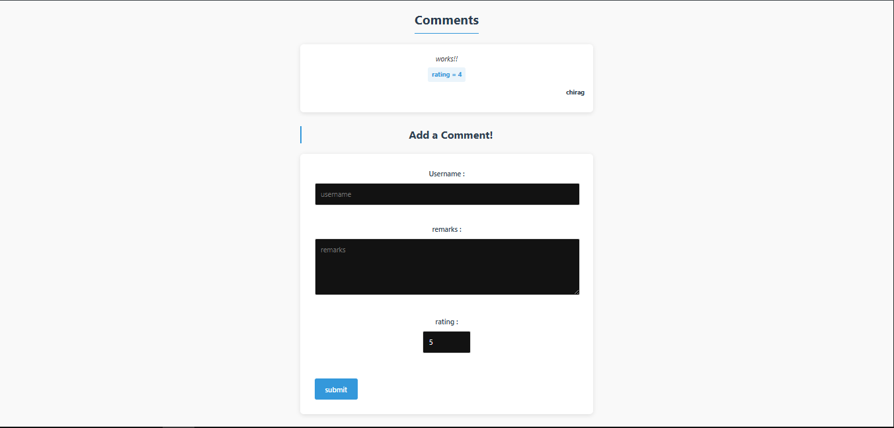

<h1>React Comments Section</h1>

This project is a React-based comments section built using Vite. It allows users to add comments with a username, remarks, and rating while demonstrating key React concepts.

<h2>Features</h2>
<ul>
  <li>Dynamic comments section with React</li>
  <li>Form handling with Formik</li>
  <li>State management using React hooks</li>
  <li>Custom form validation</li>
  <li>Responsive design with custom CSS</li>
</ul>

<h2>Screenshot</h2>

<h2>Learning Highlights</h2>
<ul>
  <li><strong>Forms in React:</strong> Learned how to handle forms using Formik, which simplifies managing form state, validation, and submission.</li>
  <li><strong>State Design Pattern:</strong> Implemented state management using React's useState hook to maintain and update the comments list.</li>
  <li><strong>Lifting State Up:</strong> Used the lifting state up pattern by creating an addComment function in the parent component (CommentSection) and passing it down to the child component (CommentForm).</li>
  <li><strong>htmlFor in JSX:</strong> Used htmlFor attribute instead of the reserved JavaScript keyword "for" when creating form labels in JSX.</li>
  <li><strong>Multiple Input Handling:</strong> Managed multiple form inputs by ensuring the state variable names match the input name attributes for consistent data flow.</li>
</ul>

<h2>Formik Implementation</h2>

I used Formik to handle form state and validation:

<ul>
  <li><strong>Form State Management:</strong> Used useFormik hook to initialize form values, handle changes, and manage submission.</li>
  <li><strong>Custom Validation:</strong> Implemented a custom validate function to check if fields are empty or contain only whitespace.</li>
  <li><strong>Form Submission:</strong> Created an onSubmit handler that processes the form data and resets the form after submission.</li>
  <li><strong>Error Handling:</strong> Displayed validation errors to provide feedback to users when form requirements aren't met.</li>
</ul>

<h2>Project Structure</h2>
<ul>
  <li><strong>App.jsx:</strong> Main application component that renders the CommentSection</li>
  <li><strong>commentsection.jsx:</strong> Component that manages the comments state and renders the list of comments</li>
  <li><strong>commentsform.jsx:</strong> Form component using Formik for adding new comments</li>
  <li><strong>CSS files:</strong> Separate styling for components with responsive design</li>
</ul>

<h2>Installation and Usage</h2>
<ol>
  <li><strong>Clone the repository:</strong></li>
  <pre><code>$ git clone https://github.com/your-username/react-comments-section.git</code></pre>

  <li><strong>Navigate to the project directory:</strong></li>
  <pre><code>$ cd react-comments-section</code></pre>

  <li><strong>Install dependencies:</strong></li>
  <pre><code>$ npm install</code></pre>

  <li><strong>Start the development server:</strong></li>
  <pre><code>$ npm run dev</code></pre>

  <li><strong>Access the app in your browser at the URL provided by Vite</strong></li>
</ol>

<h2>Technologies Used</h2>
<ul>
  <li>React</li>
  <li>Vite</li>
  <li>Formik</li>
  <li>CSS</li>
</ul>

